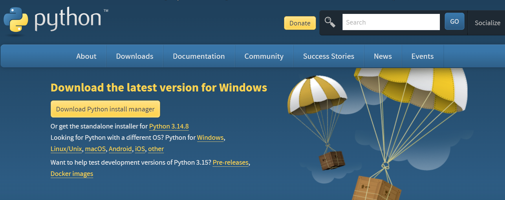

<div align="center">


# 酷狗解锁器

**把酷狗下载的加密歌曲，变成任何设备都能播放的普通音乐文件**

三步点击 · 不用命令行 · 新手友好 · 完全无损 · 全程本地离线

📄 **图文完整版**：[`docs/酷狗解锁器用户手册.pdf`](docs/酷狗解锁器用户手册.pdf)

</div>

---

## 这是什么？

你在酷狗下载的歌，其实是加密的（文件后缀是 `.kgm`、`.kgma`、`.vpr`、`.kgg`）。它们只能在酷狗里听——拷到车机、手机、U 盘、无损播放器上就"格式不支持"了。

这个工具把这些加密歌曲**一键还原成普通的 FLAC / MP3 文件**，从此哪里都能播。

> **不懂代码、没用过命令行？完全没关系，这个工具就是为你设计的。**
> 教程是按"保姆级"标准一步一步写的：装 Python、双击运行、鼠标点三下，
> 全程只需要会复制粘贴，不用看懂任何代码。

- ✅ **完全无损**：还原出来的就是你下载时的原始文件，音质一分不丢
- ✅ **三次点击**：打开界面 → 选文件 → 点开始，就这么多
- ✅ **不用联网**：所有操作都在你自己电脑上完成，音乐不会被上传到任何地方

---

## 新手教程（全程无需代码）

### 第 0 步：确认两件事

- 你的电脑是 Windows（Win10 / Win11）或 macOS（教程两边通用，🍎 标注的是 mac 差异）
- 电脑上**装了酷狗音乐客户端**（因为 `.kgg` 歌曲的"钥匙"存在酷狗里；如果你只处理 `.kgm` / `.kgma` 文件则不需要）

### 第 1 步：下载本工具

点这个链接直接下载 —— [下载 kugou-unlock.zip](https://github.com/p2109220548-ctrl/kugou-unlock/archive/refs/heads/main.zip)
（或回到本页面，点右上角绿色的 **`< > Code`** 按钮 → 点 **Download ZIP**）

下载后：右键压缩包 → **全部解压**，放到一个好找的地方（比如桌面）。

---

## 方式一：一键脚本安装（推荐 · 双击即可，不用命令行）

1. 打开解压出来的文件夹
2. **Windows**：双击 **`install_windows.bat`**，照下面 🪟 详细步骤走；**macOS**：双击 **`install_mac.command`**，照下面 🍎 详细步骤走
3. 装完后：**Windows** 双击桌面的「酷狗音乐解锁器」、**macOS** 双击文件夹里的 `start_kugou_unlocker.command`——界面就打开了！

> 🪟 **Windows 详细安装步骤**：
>
> 1. 双击 **`install_windows.bat`**——会弹出一个安装向导窗口，全程只需要回车和数字键，不用输入任何命令
> 2. **检查 Python**（向导第 1 步/共 3 步）：向导会自动寻找你电脑上已有的 Python——
>    - 显示 `[OK] 已检测到 Python：…`：什么都不用做，自动进入下一步
>    - 显示"没有检测到 Python 3.11+"并出现三选菜单：**直接回车（或输入 1）**＝自动下载官方 Python 并静默安装（约 1~2 分钟，中途闪出的小窗口属正常现象，等它跑完就好）；输入 **2**＝"我已经装了 Python"，回车后把你的 `python.exe` **直接拖进向导窗口**再回车（路径自动填上，支持拖拽；版本低于 3.11 会提示确认）；输入 **3**＝本次跳过安装 Python，以后想继续随时重新双击本脚本
> 3. **安装组件**（第 2 步/共 3 步）：自动安装处理 `.kgg` 需要的两个小组件（pycryptodome / numpy），只装一次
> 4. **创建快捷方式**（第 3 步/共 3 步）：桌面上出现 **「酷狗音乐解锁器」** 图标
> 5. 看到绿色的「**安装完成！**」就是全部装好了
>
> 💡 如果自动下载 Python 失败，向导会自己打开官方下载页，按屏幕提示装一下（记得勾选 `Add python.exe to PATH`），然后重新双击一次 `install_windows.bat` 即可。
> 💡 以后想启动，也可以直接双击文件夹里的 **`start_kugou_unlocker.bat`**。

> 💡 **一键脚本安装失败了？** 没关系——按下面这个手动方法装 Python 就好（跟着点，不用懂命令行），装完再重新双击一次 `install_windows.bat`。

<details>
<summary><font size="4"><b>手动装 Python 参考</b></font></summary>

1. 打开官网下载页：**https://www.python.org/downloads/**，页面长这样：

   

2. 点击 "**Python 3.x.x**" 这个文字链接（图中 "Or get the standalone installer for" 后面那个），下载传统安装包——它永远指向**最新稳定版**
   - ⚠️ **不要点**最上面那个黄色大按钮 "Download Python install manager"——那是新的安装管理器，界面和本教程对不上
   - 找不到链接？打开 **https://www.python.org/downloads/latest/** ——这个官方地址永远自动跳到最新稳定版的下载页，进去点 "Windows installer (64-bit)" 就能下载
   - 🍎 **macOS**：在同一个下载页选 "**macOS 64-bit universal2 installer**"；mac 安装器没有 "Add python.exe to PATH" 这个选项，装完即用，什么都不用勾
     - 系统要求 **macOS 10.13（High Sierra）或更新**——2017 年之后的 Mac 基本都满足；Intel 和 M 系列芯片（M1/M2/M3/M4…）用同一个安装包，不用挑机型
3. 双击运行安装包，**【最重要的一步】** 在安装界面**底部勾选 `Add python.exe to PATH`**（不勾的话后面双击文件会没反应；🍎 macOS 没有这一步，直接装）
4. 点 **Install Now**，等进度条走完，关掉窗口

> 怎么确认装好了？按 `Win + R`，输入 `cmd` 回车，在黑窗口里输入 `python --version` 回车，显示版本号（如 `Python 3.12.5`）就是成功了。
> 🍎 macOS：打开「终端」（启动台搜 Terminal）输入 `python3 --version`。

</details>

> 🍎 **macOS 详细安装步骤**：
>
> 1. 双击 **`install_mac.command`**——会自动弹出一个「终端」窗口开始安装，全程什么都不用输入、不用看懂，等窗口里的文字自己滚动完停下（大约一两分钟）就装好了
> 2. 第一次双击如果弹出"**无法验证开发者**"的提示（苹果对一切没有签名的文件都会拦一道，文件本身没有问题），任选一种处理：
>    - **右键**（或按住 Control 键点）文件 → 点「**打开**」→ 在弹出的窗口里再点一次「**打开**」——放行这一次之后，以后就能正常双击了
>    - 新版 macOS（版本号 15 及以上，版本号可在苹果菜单 →「关于本机」查看）如果右键里没有「打开」选项、或点了还是被拒：打开 **系统设置 → 隐私与安全性**，往下翻会看到"`install_mac.command` 已被阻止"的提示，点旁边的「**仍要打开**」→ 输入开机密码确认
> 3. 如果提示"**没有执行权限**"（Permission denied），这样解除：
>    - 打开「**终端**」App（启动台搜索"终端"或 Terminal）
>    - 输入 `chmod +x`，注意 **+x 后面要先敲一个空格**
>    - 把 `install_mac.command` 文件**直接拖进终端窗口**（完整路径会自动填上），按回车——没有任何报错就是成功了
>    - 回去重新双击即可
> 4. 装完后，双击文件夹里的 **`start_kugou_unlocker.command`** 启动界面（第一次运行同样可能遇到"无法验证开发者"，照第 2 步的方法放行一次就好）
>
> 💡 mac 上脚本安装失败的话，同样参考上面的「手动装 Python 参考」（有 🍎 标注），装完重新双击 `install_mac.command` 即可。

## 方式二：命令行安装（进阶用户）

熟悉终端的话可以手动来（效果与一键脚本完全相同）：

1. 安装 Python 3.11+（见上方"手动装 Python 参考"）
2. 在解压出来的文件夹里打开终端（Windows：文件夹空白处按住 `Shift` 点右键 →「在此处打开 PowerShell 窗口」或"在终端中打开"）
3. 执行下面这行，等显示 "Successfully installed"：

```
pip install -r requirements.txt
```

4. 启动图形界面（双击 `kugou_unlock_gui.py` 或执行 `python kugou_unlock_gui.py`）：

```
python kugou_unlock_gui.py
```

> 🍎 macOS 终端里把 `python` 换成 `python3`。
> 💡 只转换 `.kgm` / `.kgma` / `.vpr` 文件的话，`requirements.txt` 里的组件可以都不装；转换 `.kgg` 文件才需要。
> 💡 想把解压出来的 FLAC、WAV 歌曲再转成 MP3 的话，才需要安装 [FFmpeg](https://ffmpeg.org/download.html)；不转格式、保持原样就不用装。

---

### 第 2 步：三次点击，完成转换

界面上就三步，跟着数字走：

1. **选择要转换的文件** —— 首先点「**自动找到酷狗文件夹**」，工具会自动定位你酷狗的下载目录（读取酷狗自己的设置，并扫描 C 盘、D 盘等所有常见位置）；找到后会弹出一个**文件选择窗口**，列出文件夹里全部加密歌曲，**默认全部选中**——用「**全部选择**」一键全选，或按住 `Ctrl` / `Shift` 只挑想转的几首，点「确定」。也可以点「选择文件…」直接多选，或「选择整个文件夹…」后同样会弹出选择窗口
   - 🍎 **macOS**：酷狗 Mac 版下载的歌默认在「音乐」文件夹的 **KuGou** 子文件夹里；如果提示"未找到酷狗密钥库"，点「手动指定密钥库…」，按 `Cmd + Shift + G` 输入 `~/Library/Application Support`，在酷狗文件夹里选中 KGMusicV3.db（找不到就先在酷狗 Mac 版里把要转的歌播放一遍再试）
2. **选择保存位置** —— 点「选择输出文件夹」，告诉它转换好的歌放哪（比如桌面新建个"我的音乐"文件夹）
3. **选格式，点「开始转换」** —— 推荐保持默认的"保持原始格式"（完全无损），然后坐等进度条走完

完成后会有提示，点界面下方的「**打开输出文件夹**」就能看到歌了。复制到车机、手机、播放器，随便听。

---

## 常见问题

**Q：转换会损失音质吗？**
A：不会。"转换"其实是把加密外壳剥掉，里面的音乐文件原封不动。只有你主动选"MP3"输出时才会变成有损格式。

**Q：我下载的是 MP3 还是 FLAC？**
A：看你在酷狗下载时选的音质——选"无损"下来的就是 FLAC，普通音质就是 MP3。这个工具不会凭空提高音质。

**Q：支持哪些加密格式？**
A：`.kgm`、`.kgma`、`.vpr`、`.kgg` 四种，都是酷狗的加密格式。普通音乐文件（MP3/FLAC）不需要也不能用本工具处理。

**Q：能一次转换整个文件夹吗？**
A：能。点「选择整个文件夹…」选中你酷狗的下载目录，会弹出勾选窗口列出全部歌曲，默认全选，点确定就开始。

**Q：提示"密钥库中找不到这首歌的密钥"？**
A：打开酷狗，把这首歌**播放一次或重新下载**，然后回到工具重试。`.kgg` 的钥匙是酷狗在你听歌时存到本机的。

**Q：警告"未找到酷狗密钥库"？**
A：说明这台电脑没装酷狗客户端。处理 `.kgg` 文件需要先装酷狗；只处理 `.kgm` / `.kgma` / `.vpr` 则不用管它。

**Q：某一个文件总是转换失败？**
A：多半是这首歌下载不完整、或从没在酷狗里播放过（密钥缺失）。先在酷狗里播放一次或重新下载这首歌，再单独重试它；其他歌不受影响。

**Q：转换速度慢 / 文件很多要等多久？**
A：单首通常只要几秒；几百首可能要几分钟到十几分钟，取决于电脑性能。装好组件（一键脚本会自动装）会更快，转换期间别关窗口。

**Q：想把歌转成 MP3？**
A：界面里选"MP3"输出即可，但需要先安装 [FFmpeg](https://ffmpeg.org/download.html)（装好后重启工具就能用）。不过大多数情况下，"保持原始格式"就是最好的选择。

**Q：转出来的歌在手机 / 车机上不显示封面或歌名？**
A：封面和歌名来自音乐文件自带的标签，个别老歌本身就没有。换一个支持读取标签的主流播放器即可；文件本身是完好的。

**Q：双击 `install_windows.bat` 一闪而过 / 没反应？**
A：先试**右键 → 以管理员身份运行**；如果杀毒软件弹出拦截提示，看下一条。

**Q：杀毒软件 / Windows Defender 报毒或删掉了文件？**
A：这是误报。本工具是开源脚本、没有购买数字签名，部分杀软会对"自动安装脚本"这类文件敏感。请在杀软里选择"信任 / 恢复"本工具的文件，并确认你是从官方页面下载的——来路不明的版本不要信任。

**Q：双击 `.py` 文件没反应？**
A：先双击一遍 `install_windows.bat` 完成安装，之后用桌面快捷方式「酷狗音乐解锁器」打开，或双击文件夹里的 `start_kugou_unlocker.bat`。

**Q：我明明装了 Python，安装脚本却说没检测到？**
A：脚本只认 PATH 环境变量和常见安装位置（绿色版、Conda 环境它找不到）。在出现三选菜单时输入 **2**，把你的 `python.exe` 拖进窗口指定路径即可。

**Q：桌面快捷方式没创建成功？**
A：不影响使用——直接双击文件夹里的 `start_kugou_unlocker.bat` 同样能打开；或重新跑一遍一键脚本再建一次。

**Q：转换时需要联网吗？需要管理员权限吗？**
A：转换**完全离线**，音乐不会被上传到任何地方；只有安装 Python 和组件那一步需要联网。一般**不需要管理员权限**（Python 装在你自己的用户目录下）。

**Q：怎么卸载这个工具？**
A：它是绿色便携的——删除解压出来的文件夹和桌面快捷方式就等于卸载，不写注册表。之前自动安装的 Python 和小组件留在原地，不影响其他软件。

**Q：可以换一台电脑用吗？**
A：可以，在新电脑上重新下载、解压、跑一遍一键脚本即可。注意 `.kgg` 的密钥跟酷狗走：新电脑要装酷狗并播放过这些歌，密钥库里才有钥匙。

**Q：有人向我售卖这个工具，或提供"付费解锁版"？**
A：本工具**完全开源免费，没有任何收费项目**，任何形式的售卖都是假冒。请拒绝并到官方页面举报，不要向来路不明的"修复版"付款。

**Q：启动时提示"完整性校验失败"？**
A：说明程序或文档文件被修改或损坏（也可能是下载不完整）。请回到官方页面重新下载完整 ZIP 解压使用，不要使用来路不明的"修复版"。

## 完整性保护（防篡改声明）

本软件内置**完整性自校验**：程序与文档均带有开发者签发的校验清单（SHA-256 清单 + Ed25519 非对称数字签名，签名私钥仅开发者持有、不随软件分发），每次启动都会自动核验——**任何文件被修改、替换或删除，软件都会拒绝运行**，并提示你从官方页面重新下载。

**为什么要加这层加密保护？** 为了软件安全，防止篡改和乱用：

- **防篡改**：防止有人改动程序、往里面塞别的东西之后，冒充本软件分发
- **防乱用**：防止有人拿本工具二次打包、改名换姓，甚至向你收费——被改过的文件过不了校验，直接拒绝运行

同样地，随软件附带的 PDF 图文手册带有多层**水印**（署名与来源标记），目的同样是**防冒用、可溯源**：万一有人截取手册内容冒充自己的教程，水印能证明出处。水印不影响正常阅读。

**重要：本工具完全开源免费，没有任何收费项目。**

- 从官方页面（本仓库）下载、安装、使用、更新，**全程 0 元**，不需要任何付费、解锁、会员
- 程序里**不存在**任何"付费版""解锁码""会员群"之类的入口
- **如果有人向你售卖本工具、或提供"付费解锁版"，一律是假冒诈骗**——请直接拒绝，并欢迎到官方页面举报
- 看到校验失败提示，请勿相信来路不明的"修复版"

## 合规与免责

- 本工具由 [鼠鼠shushuu](https://github.com/p2109220548-ctrl) 开发：**禁止商用，仅限个人使用**；分享时请保留本页署名与 LICENSE 文件。
- 本工具**仅供处理你本人拥有合法使用权的本地文件**（自己账号下载的音乐），用于个人设备播放等合理用途。
- 解密产物**仅限私人使用**，请勿二次分发、传播或商用。
- 本项目不包含任何绕过付费的逻辑：`.kgg` 密钥完全来自你本机酷狗客户端已经生成的密钥库。
- 本工具**开源且完全免费，没有任何收费项目**：任何形式的售卖、捆绑收费、"付费解锁"均为假冒，与开发者无关——遇到请拒绝，并欢迎到官方页面举报。
- 使用本项目即表示你已理解并同意遵守所在国家或地区的法律法规与平台服务条款。

🔗 **项目主页**：https://github.com/p2109220548-ctrl/kugou-unlock ——觉得好用的话，点个 Star ⭐ 支持一下；工具更新也会第一时间发在这里。

## 进阶：命令行用法（可选）

熟悉命令行的朋友也可以直接用核心脚本：

```bash
python kugou_unlock.py "C:\KuGou\KugouMusic" decrypted/          # 整个目录
python kugou_unlock.py src/ out/ --fmt mp3                        # 顺带转成 MP3
python kugou_unlock.py src/ out/ --only kgm,kgg --procs 8         # 只处理部分格式
```

## 致谢

算法与常量来自以下开源项目的公开实现，感谢社区：
[unlock-music (um/cli)](https://git.unlock-music.dev/um/cli) · [Kugo-Music-Converter](https://github.com/skxxxkx666/Kugo-Music-Converter) · [libtakiyasha](https://github.com/nukemiko/libtakiyasha) · [kugou-audio-unlock](https://github.com/onavcn/kugou-audio-unlock)

## 许可 / License

本项目由 [鼠鼠shushuu](https://github.com/p2109220548-ctrl) 开发，采用[个人非商业使用许可](LICENSE)：
**禁止商用、仅限个人使用**；非营利的分享与教学允许，任何副本必须保留"由 鼠鼠shushuu 开发"的署名。
